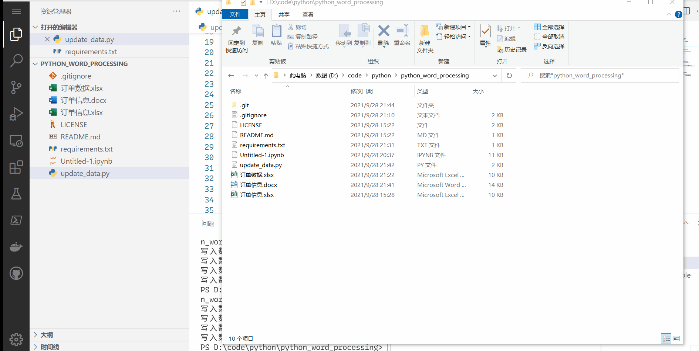

# python_word_processing

## 说明

此项目包含了了使用python读取和修改Word和Excel文件的示例。首先读取数据，然后填入到其他文档中。



## 环境准备

1. 安装Python：[Python下载](https://www.python.org/downloads/)

2. 安装需要的包：
```cmd
pip install openpyxl python-docx
```

3. 运行
```cmd
python update_data.py
```

## 注意

利用Python实现文档自动填充理论上是可行的，但需要考虑以下问题：
1. 此代码假定数据都填充在对应名称的右边，实际应用中有可能要对应名称的下方。
2. 填充的数据会丢失原来的样式。
3. 多行数据、二维表格的读取和填充。
